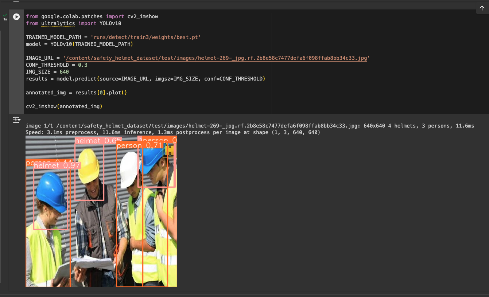
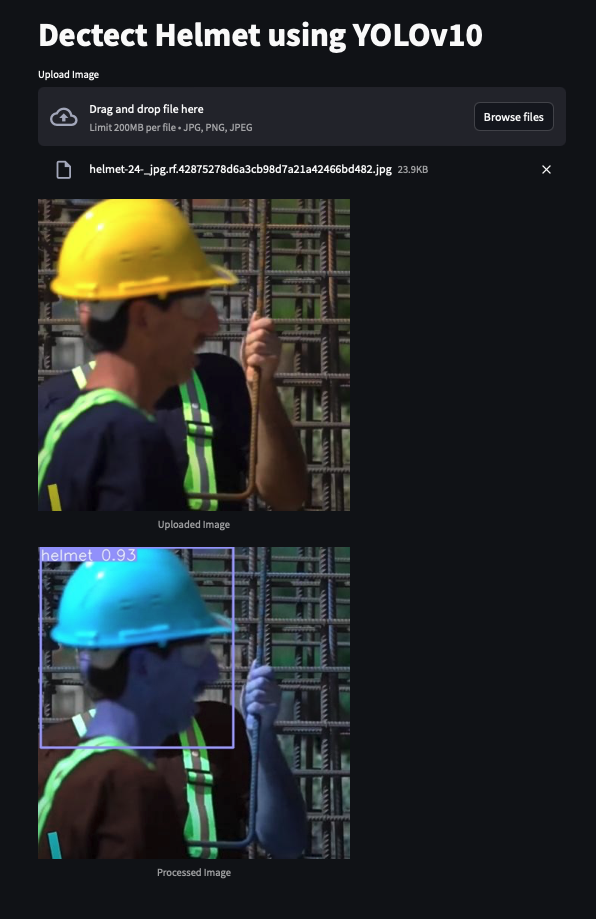

# Detect Helmet using YOLOv10

## Table of Contents

1. [Introduction](#introduction)
2. [Installation](#installation)
3. [Training Guide](#training-guide)
4. [Demo](#demo)

## Introduction

Utilizing YOLOv10 for helmet detection represents a leap in ensuring safety through advanced object detection technology. This project applies YOLOv10's cutting-edge capabilities to identify helmets, crucial for safety in construction and traffic compliance. It showcases the model's precision and speed in real-world scenarios, emphasizing its role in enhancing safety measures. This effort highlights the practical application of AI in critical safety tasks, demonstrating YOLOv10's impact on public and workplace safety.

## Installation

To run these applications locally, follow these steps:

1. Clone this repository:

```bash
git clone https://github.com/namdevdk2710/detect-helmet-yolo-v10.git
cd detect-helmet-yolo-v10
```

2. Install the required dependencies:

```bash
pip install -r requirements.txt
```

3. Install the required YOLOv10 dependencies:

```bash
cd yolov10
pip install .
```

4. Run the applications using Streamlit:

```bash
streamlit run main.py
```

## Training Guide
1. Download and unzip data training:
```bash
!gdown '1twdtZEfcw4ghSZIiPDypJurZnNXzMO7R'
!mkdir safety_helmet_dataset
!unzip -q 'Safety_Helmet_Dataset.zip' -d 'safety_helmet_dataset'
```

2. Clone and download YOLOv10 and training model:
```bash
!git clone https://github.com/THU-MIG/yolov10.git
!wget https://github.com/THU-MIG/yolov10/releases/download/v1.1/yolov10n.pt
%cd yolov10

!pip install -q -r requirements.txt
!pip install -e .
```

3. Training model:
```python
from ultralytics import YOLOv10

MODEL_PATH = 'yolov10n.pt'
model = YOLOv10(MODEL_PATH)

YAML_PATH = '../safety_helmet_dataset/data.yaml'
EPOCHS = 50
IMG_SIZE = 640
BATCH_SIZE = 64

model.train(data=YAML_PATH, epochs=EPOCHS, batch=BATCH_SIZE, imgsz=IMG_SIZE)
```

4. Test model:
```python
TRAINED_MODEL_PATH = 'runs/detect/train3/weights/best.pt'
model = YOLOv10(TRAINED_MODEL_PATH)

model.val(data=YAML_PATH, imgsz=IMG_SIZE, split='test')
```

5. Use model:
```python
from google.colab.patches import cv2_imshow
from ultralytics import YOLOv10

TRAINED_MODEL_PATH = 'runs/detect/train3/weights/best.pt'
model = YOLOv10(TRAINED_MODEL_PATH)

IMAGE_URL = 'file-test.jpg'
CONF_THRESHOLD = 0.3
results = model.predict(source=IMAGE_URL, imgsz=IMG_SIZE, conf=CONF_THRESHOLD)

annotated_img = results[0].plot()

cv2_imshow(annotated_img)
```

## Demo

<p align='center'>
  
</p>

<p align='center'>
  
</p>
